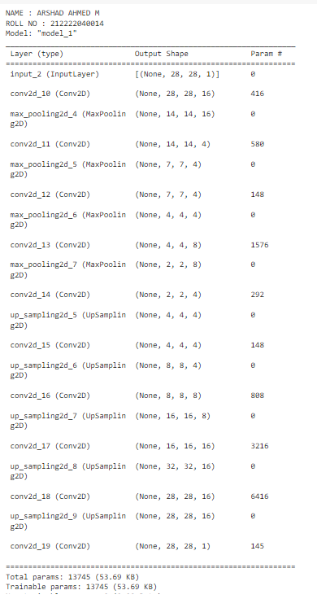
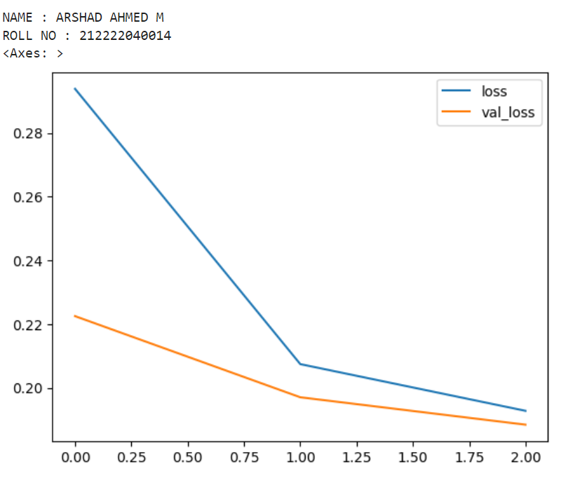

<h1 align='center'>Convolutional Autoencoder for Image Denoising</h1> 

## AIM:

To develop a convolutional autoencoder for image denoising application.

## Problem Statement and Dataset:

- Autoencoder is an unsupervised artificial neural network that is trained to copy its input to output.
- An autoencoder will first encode the image into a lower-dimensional representation, then decodes the representation back to the image.
- The goal of an autoencoder is to get an output that is identical to the input. Autoencoders uses MaxPooling, convolutional and upsampling layers to denoise the image.
- We are using MNIST Dataset for this experiment.
- The MNIST dataset is a collection of handwritten digits.
- The task is to classify a given image of a handwritten digit into one of 10 classes representing integer values from 0 to 9, inclusively.
- The dataset has a collection of 60,000 handwrittend digits of size 28 X 28.
- Here we build a convolutional neural network model that is able to classify to it's appropriate numerical value.

<p align="center">
  


</p>

## Convolution Autoencoder Network Model:

<p align="center">
  


</p>


## DESIGN STEPS

- **Step 1:** Import the necessary libraries and dataset.
- **Step 2:**  Load the dataset and scale the values for easier computation.
- **Step 3:** Add noise to the images randomly for both the train and test sets.
- **Step 4:** Build the Neural Model using
    * Convolutional Layer
    * Pooling Layer
    * Up Sampling Layer.
    - Make sure the input shape and output shape of the model are identical.
- **Step 5:** Pass test data for validating manually.
- **Step 6:** Plot the predictions for visualization.

## PROGRAM


```py
print("NAME :ARSHAD AHMED M")
print("212222040014")
import pandas as pd
import numpy as np
import matplotlib.pyplot as plt

from tensorflow import keras
from tensorflow.keras import layers, utils, models
from tensorflow.keras.datasets import mnist

```

```py
(x_train, _), (x_test, _) = mnist.load_data()
```
```py
x_train.shape
```
```py
x_train_scaled = x_train.astype('float32') / 255.
x_test_scaled = x_test.astype('float32') / 255.
```
```py
x_train_scaled = np.reshape(x_train_scaled, (len(x_train_scaled), 28, 28, 1))
x_test_scaled = np.reshape(x_test_scaled, (len(x_test_scaled), 28, 28, 1))
```
```py
noise_factor = 0.5
x_train_noisy = x_train_scaled + noise_factor*np.random.normal(loc=0.0, scale=1.0,
                                                               size=x_train_scaled.shape)
```
```py
x_test_noisy = x_test_scaled + noise_factor*np.random.normal(loc=0.0, scale=1.0,
                                                             size=x_test_scaled.shape)
```
```py
x_train_noisy = np.clip(x_train_noisy, 0., 1.)
x_test_noisy = np.clip(x_test_noisy, 0., 1.)
```
```py
n = 10
plt.figure(figsize=(20, 2))
for i in range(1, n + 1):
    ax = plt.subplot(1, n, i)
    plt.imshow(x_test_noisy[i].reshape(28, 28))
    plt.gray()
    ax.get_xaxis().set_visible(False)
    ax.get_yaxis().set_visible(False)
plt.show()
```

#### Noicy Image 


```py
input_img = keras.Input(shape=(28, 28, 1))
```
```py
x=layers.Conv2D(16,(5,5),activation='relu',padding='same')(input_img)
x=layers.MaxPooling2D((2,2),padding='same')(x)
x=layers.Conv2D(4,(3,3),activation='relu',padding='same')(x)
x=layers.MaxPooling2D((2,2),padding='same')(x)
x=layers.Conv2D(4,(3,3),activation='relu',padding='same')(x)
x=layers.MaxPooling2D((2,2),padding='same')(x)
x=layers.Conv2D(8,(7,7),activation='relu',padding='same')(x)
encoded = layers.MaxPooling2D((2, 2), padding='same')(x)

x=layers.Conv2D(4,(3,3),activation='relu',padding='same')(encoded)
x=layers.UpSampling2D((2,2))(x)
x=layers.Conv2D(4,(3,3),activation='relu',padding='same')(x)
x=layers.UpSampling2D((2,2))(x)
x=layers.Conv2D(8,(5,5),activation='relu',padding='same')(x)
x=layers.UpSampling2D((2,2))(x)
x=layers.Conv2D(16,(5,5),activation='relu',padding='same')(x)
x=layers.UpSampling2D((2,2))(x)
x=layers.Conv2D(16,(5,5),activation='relu')(x)
x=layers.UpSampling2D((1,1))(x)
decoded = layers.Conv2D(1, (3, 3), activation='sigmoid', padding='same')(x)

autoencoder = keras.Model(input_img, decoded)
```
```py
autoencoder.summary()
```

#### Model Summary




```py
autoencoder.compile(optimizer='adam', loss='binary_crossentropy')

autoencoder.fit(x_train_noisy, x_train_scaled,
                epochs=3,
                batch_size=256,
                shuffle=True,
                validation_data=(x_test_noisy, x_test_scaled))
```
```py
metrics = pd.DataFrame(autoencoder.history.history)
metrics[['loss','val_loss']].plot()
```
```py
decoded_imgs = autoencoder.predict(x_test_noisy)
```
```py
n = 10
```
```py
plt.figure(figsize=(20, 4))
for i in range(1, n + 1):
    # Display original
    ax = plt.subplot(3, n, i)
    plt.imshow(x_test_scaled[i].reshape(28, 28))
    plt.gray()
    ax.get_xaxis().set_visible(False)
    ax.get_yaxis().set_visible(False)

    # Display noisy
    ax = plt.subplot(3, n, i+n)
    plt.imshow(x_test_noisy[i].reshape(28, 28))
    plt.gray()
    ax.get_xaxis().set_visible(False)
    ax.get_yaxis().set_visible(False)    

    # Display reconstruction
    ax = plt.subplot(3, n, i + 2*n)
    plt.imshow(decoded_imgs[i].reshape(28, 28))
    plt.gray()
    ax.get_xaxis().set_visible(False)
    ax.get_yaxis().set_visible(False)
plt.show()
```


## OUTPUT

### Training Loss, Validation Loss Vs Iteration Plot




### Original vs Noisy Vs Reconstructed Image


## RESULT

### Thus we have successfully developed a convolutional autoencoder for image denoising application.

